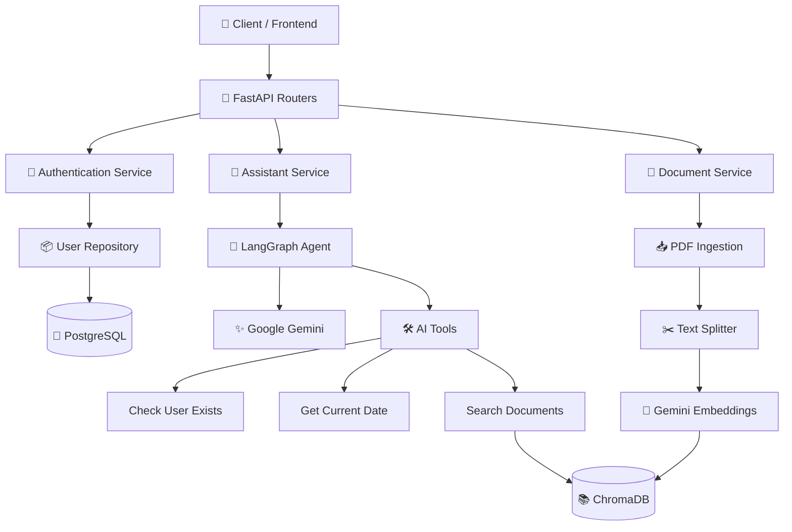

# Enterprise AI Assistant

**Enterprise AI Assistant** is a production-inspired AI backend built with **FastAPI**, **LangGraph**, and **Google Gemini**. It demonstrates modern backend engineering practices including JWT authentication, dependency injection, the repository pattern, retrieval-augmented generation (RAG), PDF document ingestion, Docker-based deployment, automated testing, and GitHub Actions CI.

The project was built to explore how traditional backend architecture can be combined with GenAI workflows to create scalable, AI-powered applications. Rather than functioning as a simple chatbot, it is designed as a backend service that can orchestrate AI models, business logic, enterprise data, and external tools through a structured and maintainable architecture.

## Why this project matters

Many organizations have large volumes of internal documentation, policies, knowledge bases, and operational procedures that are difficult for employees to search manually. This project demonstrates how an AI assistant can securely retrieve relevant information from enterprise documents, combine it with business logic and application data, and provide contextual responses through a REST API.

## ✨ Features

### 🔐 Authentication & Security

- User registration and login with **JWT-based authentication**
- Secure password hashing using **bcrypt**
- Protected API endpoints with reusable authentication dependencies

### 🤖 Enterprise AI Assistant

- Ask natural language questions through a REST API
- AI-powered responses using **Google Gemini**
- Intelligent workflow orchestration with **LangGraph**

### 🛠️ Tool Calling

The AI agent can dynamically invoke backend tools, including:

- Checking whether a user exists in the database
- Retrieving the current date
- Searching enterprise documents using RAG

### 📄 Retrieval-Augmented Generation (RAG)

- Upload PDF documents through an API
- Automatically split documents into semantic chunks
- Generate embeddings using **Gemini Embeddings**
- Store vectors in **ChromaDB**
- Retrieve relevant context before generating responses

### 🏗️ Backend Architecture

- Layered architecture following clean design principles
- Repository Pattern
- Service Layer
- Dependency Injection
- Global Exception Handling
- SQLAlchemy ORM with Alembic migrations

### 🗄️ Persistence

- PostgreSQL as the primary database
- SQLAlchemy ORM
- Alembic database migrations
- UUID-based user entities

### 🧪 Testing

- Unit tests using **pytest**
- In-memory SQLite for isolated database tests
- Mocked AI dependencies for deterministic testing
- High code coverage

### 🐳 Containerization

- Dockerized application
- Docker Compose for local development
- Environment-based configuration using `.env`

### 🚀 Continuous Integration

- Automated testing using **GitHub Actions**
- Test suite executed on every push and pull request
- Coverage reporting integrated into the CI pipeline

## 🏛️ System Architecture

### Architecture Highlights

- **FastAPI** exposes REST APIs for authentication, AI interactions, document ingestion, and health monitoring.
- **Authentication Service** handles user registration, login, password hashing, and JWT generation.
- **Assistant Service** orchestrates AI interactions by delegating requests to a LangGraph workflow.
- **LangGraph** determines whether the LLM should answer directly or invoke one or more backend tools.
- **Tool Calling** enables the AI agent to interact with application services such as database lookups, document retrieval, and utility functions.
- **RAG Pipeline** retrieves relevant document chunks from ChromaDB before the LLM generates its final response.
- **PostgreSQL** stores persistent application data, while **ChromaDB** stores vector embeddings for semantic search.
