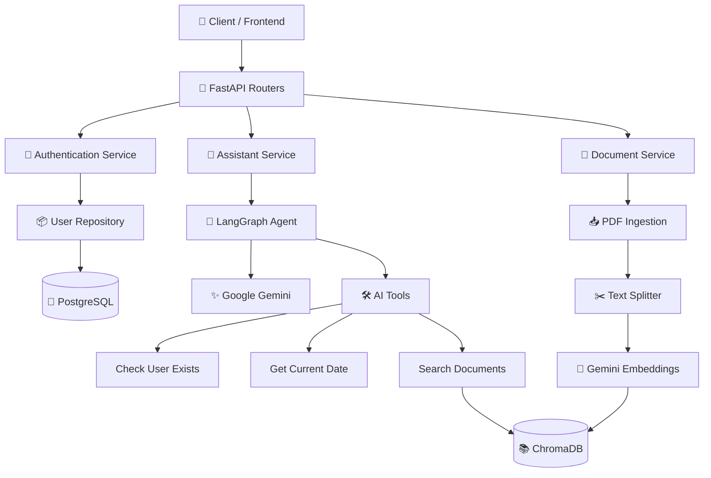
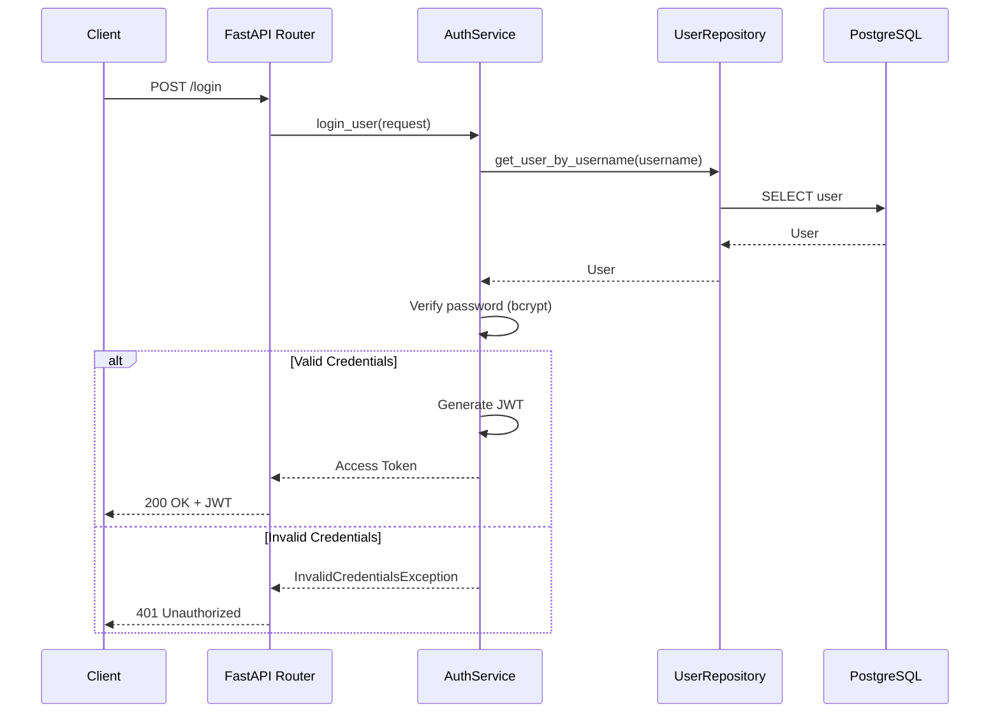
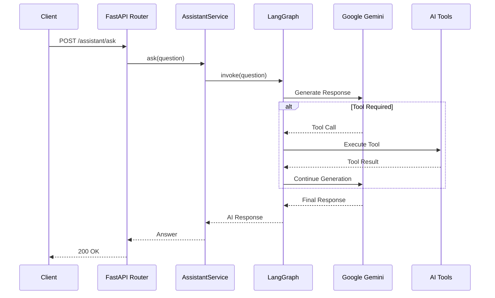
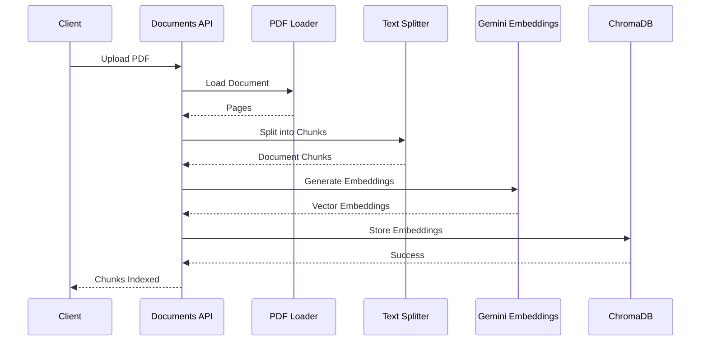
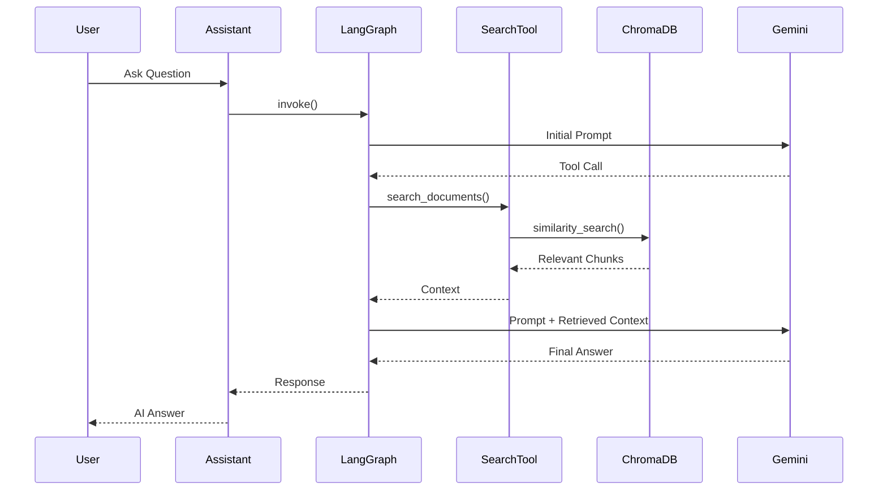

# Enterprise AI Assistant


**Enterprise AI Assistant** is a production-inspired AI backend built with **FastAPI**, **LangGraph**, and **Google Gemini**. It demonstrates modern backend engineering practices including JWT authentication, dependency injection, the repository pattern, retrieval-augmented generation (RAG), PDF document ingestion, Docker-based deployment, automated testing, and GitHub Actions CI.

The project was built to explore how traditional backend architecture can be combined with GenAI workflows to create scalable, AI-powered applications. Rather than functioning as a simple chatbot, it is designed as a backend service that can orchestrate AI models, business logic, enterprise data, and external tools through a structured and maintainable architecture.

## Why this project matters

Many organizations have large volumes of internal documentation, policies, knowledge bases, and operational procedures that are difficult for employees to search manually. This project demonstrates how an AI assistant can securely retrieve relevant information from enterprise documents, combine it with business logic and application data, and provide contextual responses through a REST API.

## ✨ Features

### 🔐 Authentication & Security

- User registration and login with **JWT-based authentication**
- Secure password hashing using **bcrypt**
- Protected API endpoints with reusable authentication dependencies

### 🤖 Enterprise AI Assistant

- Ask natural language questions through a REST API
- AI-powered responses using **Google Gemini**
- Intelligent workflow orchestration with **LangGraph**

### 🛠️ Tool Calling

The AI agent can dynamically invoke backend tools, including:

- Checking whether a user exists in the database
- Retrieving the current date
- Searching enterprise documents using RAG

### 📄 Retrieval-Augmented Generation (RAG)

- Upload PDF documents through an API
- Automatically split documents into semantic chunks
- Generate embeddings using **Gemini Embeddings**
- Store vectors in **ChromaDB**
- Retrieve relevant context before generating responses

### 🏗️ Backend Architecture

- Layered architecture following clean design principles
- Repository Pattern
- Service Layer
- Dependency Injection
- Global Exception Handling
- SQLAlchemy ORM with Alembic migrations

### 🗄️ Persistence

- PostgreSQL as the primary database
- SQLAlchemy ORM
- Alembic database migrations
- UUID-based user entities

### 🧪 Testing

- Unit tests using **pytest**
- In-memory SQLite for isolated database tests
- Mocked AI dependencies for deterministic testing
- High code coverage

### 🐳 Containerization

- Dockerized application
- Docker Compose for local development
- Environment-based configuration using `.env`

### 🚀 Continuous Integration

- Automated testing using **GitHub Actions**
- Test suite executed on every push and pull request
- Coverage reporting integrated into the CI pipeline

## 🏛️ System Architecture



### Architecture Highlights

- **FastAPI** exposes REST APIs for authentication, AI interactions, document ingestion, and health monitoring.
- **Authentication Service** handles user registration, login, password hashing, and JWT generation.
- **Assistant Service** orchestrates AI interactions by delegating requests to a LangGraph workflow.
- **LangGraph** determines whether the LLM should answer directly or invoke one or more backend tools.
- **Tool Calling** enables the AI agent to interact with application services such as database lookups, document retrieval, and utility functions.
- **RAG Pipeline** retrieves relevant document chunks from ChromaDB before the LLM generates its final response.
- **PostgreSQL** stores persistent application data, while **ChromaDB** stores vector embeddings for semantic search.

## 🔐 Authentication Flow



## 🤖 AI Request Flow



## 📄 Document Ingestion (RAG)



## 🔎 Retrieval-Augmented Generation (RAG)



# 🏗️ Design Principles

This project follows a **layered architecture** to separate responsibilities, improve maintainability, and keep business logic independent of infrastructure concerns. Each layer has a single responsibility and communicates only with the layers below it.

```text
                HTTP Request
                     │
                     ▼
            FastAPI Routers
                     │
                     ▼
             Service Layer
                     │
                     ▼
          Repository Layer
                     │
                     ▼
          PostgreSQL Database
```

For AI-related requests, the Service Layer orchestrates the LangGraph workflow:

```text
                HTTP Request
                     │
                     ▼
            FastAPI Router
                     │
                     ▼
          Assistant Service
                     │
                     ▼
             LangGraph Agent
                     │
        ┌────────────┴────────────┐
        ▼                         ▼
 Google Gemini              AI Tools (RAG, Date, User Lookup)
                                    │
                                    ▼
                              ChromaDB / PostgreSQL
```

---

## 🎯 Presentation Layer

**Responsibility**

- Exposes REST APIs
- Validates incoming requests
- Returns standardized responses
- Delegates business logic to services

**Components**

```text
app/routers/
```

**Key Principle**

> Routers should remain thin. They coordinate requests and responses without containing business logic.

---

## 🧠 Service Layer

**Responsibility**

- Implements business logic
- Coordinates repositories and AI workflows
- Handles authentication and authorization logic
- Orchestrates LangGraph execution

**Components**

```text
app/services/
```

**Key Principle**

> Services define _what_ the application does, independent of how data is stored or retrieved.

---

## 🗄️ Repository Layer

**Responsibility**

- Encapsulates all database interactions
- Executes queries using SQLAlchemy
- Keeps persistence logic separate from business logic

**Components**

```text
app/repositories/
```

**Key Principle**

> Services should never execute SQL directly. All persistence operations pass through repositories.

---

## 🤖 AI Layer

**Responsibility**

- Orchestrates AI workflows
- Executes tool-calling
- Performs Retrieval-Augmented Generation (RAG)
- Manages vector search and document ingestion

**Components**

```text
app/ai/
```

**Key Principle**

> AI orchestration is isolated from business logic, making workflows easier to extend, test, and maintain.

---

## 🔒 Security Layer

**Responsibility**

- Password hashing
- JWT generation and validation
- Authentication dependencies
- Protected route authorization

**Components**

```text
app/security/
```

**Key Principle**

> Security concerns are centralized to ensure consistent authentication across the application.

---

## 🛠️ Infrastructure Layer

**Responsibility**

- Database session management
- Application configuration
- Environment variables
- Dependency initialization

**Components**

```text
app/database/
app/config.py
```

**Key Principle**

> Infrastructure code provides technical capabilities without containing business rules.

---

## 🧪 Testing Strategy

The project follows a testing approach that emphasizes **fast, deterministic, and isolated** unit tests.

- External services such as Google Gemini, ChromaDB, and PostgreSQL are mocked during testing.
- An in-memory SQLite database is used for repository and API tests.
- Dependency overrides replace production implementations with lightweight test doubles.
- The test suite runs quickly without requiring API keys, containers, or network access.

This approach enables rapid feedback during development while ensuring the application's business logic remains thoroughly validated.

---

## 📐 Design Principles Applied

The implementation is guided by several established software engineering principles:

- **Single Responsibility Principle (SRP)** — Each class and module has one clearly defined responsibility.
- **Dependency Injection (DI)** — Dependencies are injected through FastAPI, improving modularity and testability.
- **Repository Pattern** — Database access is abstracted behind repositories.
- **Separation of Concerns** — Routing, business logic, persistence, AI orchestration, and security are isolated into dedicated layers.
- **Composition over Tight Coupling** — Services compose repositories, AI agents, and tools rather than instantiating them internally.
- **Testability by Design** — Components can be independently mocked and verified through unit tests.

## 📂 Project Structure

```text
enterprise-ai-assistant/
│
├── app/
│   ├── ai/
│   │   ├── graph.py              # LangGraph workflow orchestration
│   │   ├── ingestion.py          # PDF ingestion pipeline
│   │   ├── tools.py              # AI tools available to the LLM
│   │   └── vector_store.py       # ChromaDB configuration
│   │
│   ├── database/
│   │   ├── base.py               # SQLAlchemy Base
│   │   └── session.py            # Database session management
│   │
│   ├── entities/
│   │   └── user.py               # User ORM model
│   │
│   ├── exceptions/
│   │   └── auth_exceptions.py    # Custom authentication exceptions
│   │
│   ├── handlers/
│   │   └── exception_handlers.py # Global exception handlers
│   │
│   ├── models/
│   │   ├── requests.py           # API request models
│   │   └── responses.py          # API response models
│   │
│   ├── repositories/
│   │   └── user_repository.py    # Database access layer
│   │
│   ├── routers/
│   │   ├── assistant.py          # AI Assistant endpoints
│   │   ├── auth.py               # Authentication endpoints
│   │   ├── documents.py          # Document ingestion endpoints
│   │   └── health.py             # Health check endpoint
│   │
│   ├── security/
│   │   ├── auth_dependency.py    # JWT authentication dependency
│   │   └── jwt_handler.py        # JWT creation & validation
│   │
│   ├── services/
│   │   ├── assistant_service.py  # AI business logic
│   │   └── auth_service.py       # Authentication business logic
│   │
│   ├── config.py                 # Application configuration
│   └── main.py                   # FastAPI application entry point
│
├── alembic/                      # Database migrations
├── tests/                        # Unit test suite
├── .github/workflows/            # GitHub Actions CI
├── docker-compose.yml            # Local container orchestration
├── Dockerfile                    # API container image
├── requirements.txt              # Python dependencies
└── README.md                     # Project documentation
```

# 🛠️ Technology Stack

| Category            | Technology                                 |
| ------------------- | ------------------------------------------ |
| Language            | Python 3.13                                |
| Backend Framework   | FastAPI                                    |
| ORM                 | SQLAlchemy                                 |
| Database            | PostgreSQL                                 |
| Database Migrations | Alembic                                    |
| Authentication      | JWT (PyJWT)                                |
| Password Hashing    | bcrypt                                     |
| AI Framework        | LangChain                                  |
| Agent Orchestration | LangGraph                                  |
| LLM                 | Google Gemini (`gemini-flash-latest`)      |
| Embeddings          | Gemini Embeddings (`gemini-embedding-001`) |
| Vector Database     | ChromaDB                                   |
| Document Loader     | PyPDFLoader                                |
| Text Splitting      | RecursiveCharacterTextSplitter             |
| Testing             | pytest                                     |
| Containerization    | Docker & Docker Compose                    |
| CI/CD               | GitHub Actions                             |
| Configuration       | python-dotenv                              |

# 📡 API Endpoints

## Authentication

| Method | Endpoint    | Description                         |
| ------ | ----------- | ----------------------------------- |
| POST   | `/register` | Register a new user                 |
| POST   | `/login`    | Authenticate user and generate JWT  |
| GET    | `/me`       | Retrieve authenticated user profile |

---

## AI Assistant

| Method | Endpoint         | Description                                  |
| ------ | ---------------- | -------------------------------------------- |
| POST   | `/assistant/ask` | Ask questions to the Enterprise AI Assistant |

---

## Document Management

| Method | Endpoint            | Description                             |
| ------ | ------------------- | --------------------------------------- |
| POST   | `/documents/ingest` | Upload a PDF and index it into ChromaDB |

---

## Health

| Method | Endpoint  | Description              |
| ------ | --------- | ------------------------ |
| GET    | `/health` | Application health check |

---

# 🚀 Getting Started

## 1. Clone the Repository

```bash
git clone https://github.com/<your-username>/enterprise-ai-assistant.git

cd enterprise-ai-assistant
```

---

## 2. Create a Virtual Environment

```bash
python -m venv .venv
```

### Windows

```bash
.venv\Scripts\activate
```

### macOS / Linux

```bash
source .venv/bin/activate
```

---

## 3. Install Dependencies

```bash
pip install -r requirements.txt
```

---

## 4. Configure Environment Variables

Create a `.env` file in the project root.

```env
GOOGLE_API_KEY=your_google_api_key

JWT_SECRET_KEY=your_secret_key

POSTGRES_USER=postgres

POSTGRES_PASSWORD=password

POSTGRES_DB=enterprise_ai
```

---

## 5. Start PostgreSQL using Docker

```bash
docker compose up -d db
```

---

## 6. Run Database Migrations

```bash
alembic upgrade head
```

---

## 7. Start the Application

```bash
uvicorn app.main:app --reload
```

The API will be available at:

```
http://localhost:8000
```

Swagger Documentation:

```
http://localhost:8000/docs
```

---

# 🧪 Running Tests

Run the complete unit test suite:

```bash
pytest
```

Run with verbose output:

```bash
pytest -v
```

Generate a coverage report:

```bash
pytest --cov=app --cov-report=term-missing
```

Generate an HTML coverage report:

```bash
pytest --cov=app --cov-report=html
```

Open the generated report:

```
htmlcov/index.html
```

### Current Coverage

- ✅ 94% code coverage
- Fast execution using mocked dependencies
- No external API calls during testing
- No PostgreSQL instance required
- No ChromaDB required
- No Google Gemini API key required

---

# 🐳 Docker

Build and start the services:

```bash
docker compose up --build
```

Stop the services:

```bash
docker compose down
```

Reset PostgreSQL volume:

```bash
docker compose down -v
```

The Docker setup includes:

- FastAPI application
- PostgreSQL database
- Environment-based configuration
- Persistent database storage

---

# ⚙️ Continuous Integration

This project uses **GitHub Actions** to automatically validate every push and pull request.

The CI pipeline performs the following steps:

- Checks out the latest source code
- Sets up Python
- Installs project dependencies
- Executes the complete pytest suite
- Fails the workflow if any test fails

This ensures that every committed change maintains application stability and prevents regressions before code is merged.

---

# 🧩 Engineering Challenges & Lessons Learned

Throughout the development of this project, I encountered several real-world engineering challenges. Solving these problems significantly improved my understanding of FastAPI, SQLAlchemy, LangGraph, Docker, testing, and software architecture.

| Phase                      | Challenge                                                               | Root Cause                                                                    | Solution                                                                                  | Key Lesson                                                                                         |
| -------------------------- | ----------------------------------------------------------------------- | ----------------------------------------------------------------------------- | ----------------------------------------------------------------------------------------- | -------------------------------------------------------------------------------------------------- |
| **1. Persistence Layer**   | SQLAlchemy models were not creating tables during testing.              | `Base.metadata.create_all()` only registers imported models.                  | Imported the `User` entity before calling `create_all()`.                                 | SQLAlchemy metadata is populated only after model classes are imported.                            |
| **2. Database Migrations** | Alembic failed to detect ORM models.                                    | Entity modules were not imported into `alembic/env.py`.                       | Imported all entities before exposing `Base.metadata`.                                    | Alembic relies on SQLAlchemy metadata, not automatic file discovery.                               |
| **3. Authentication**      | bcrypt and Passlib produced compatibility issues.                       | Version mismatch between the installed packages.                              | Switched to direct `bcrypt` usage.                                                        | Reducing unnecessary dependencies can simplify maintenance.                                        |
| **4. Authentication**      | Dependency Injection was incorrectly implemented.                       | Services were instantiated during module import instead of per request.       | Refactored to use FastAPI's `Depends()` for dependency injection.                         | Request-scoped dependencies improve modularity and testability.                                    |
| **5. Authentication**      | Custom exception handlers returned generic 500 errors.                  | Exception handlers were not registered with FastAPI.                          | Added global exception handler registration during application startup.                   | Custom exceptions must be explicitly mapped to HTTP responses.                                     |
| **6. Authentication**      | Password hashing helper caused runtime errors.                          | Utility methods were missing the `@staticmethod` decorator.                   | Converted helper methods into static methods.                                             | Utility methods that don't depend on object state should be static.                                |
| **7. AI Agent**            | LangGraph nodes unexpectedly returned `None`.                           | An indentation mistake prevented the node from returning state updates.       | Corrected the control flow to always return a valid state dictionary.                     | Every LangGraph node must consistently return state for workflow execution.                        |
| **8. RAG Pipeline**        | Chunk overlap appeared to be ignored.                                   | The sample document was too small for overlap to take effect.                 | Tested with larger documents and verified chunk boundaries.                               | Understand how chunking algorithms behave before assuming a configuration issue.                   |
| **9. Configuration**       | Environment variables caused application startup failures.              | Incorrect usage of `os.getenv()` resulted in invalid configuration values.    | Corrected the environment variable loading logic.                                         | Small configuration mistakes can prevent an application from starting.                             |
| **10. Docker Deployment**  | PostgreSQL authentication continued to fail after changing credentials. | Docker volumes preserved the previous database configuration.                 | Removed existing volumes using `docker compose down -v` before recreating containers.     | Persistent Docker volumes survive container recreation and may require manual reset.               |
| **11. Testing**            | In-memory SQLite lost tables between requests.                          | Each connection created a separate in-memory database.                        | Reused a shared database connection during tests.                                         | SQLite in-memory databases are scoped to individual connections.                                   |
| **12. Testing**            | AI tests were slow and depended on external services.                   | Unit tests directly invoked Gemini, ChromaDB, and LangGraph.                  | Introduced dependency injection and mocked external components.                           | Reliable unit tests should be deterministic, isolated, and independent of external infrastructure. |
| **13. Testing**            | LangChain tool-calling tests failed unexpectedly.                       | LangChain automatically enriched tool call payloads with additional metadata. | Updated assertions to validate behavior instead of exact payload structure.               | Avoid coupling tests to implementation details of third-party libraries.                           |
| **14. Testing**            | Improving coverage without writing redundant tests.                     | Increasing coverage can unintentionally duplicate existing behavior tests.    | Focused on covering previously untested execution paths rather than repeating assertions. | High-quality tests prioritize meaningful behavior coverage over percentage alone.                  |

---

## 📚 Key Takeaways

This project strengthened my understanding of:

- Designing maintainable backend systems using layered architecture.
- Building secure authentication with JWT and bcrypt.
- Managing database schema evolution with Alembic.
- Applying dependency injection to improve modularity and testability.
- Developing AI workflows using LangChain and LangGraph.
- Implementing Retrieval-Augmented Generation (RAG) with ChromaDB.
- Writing fast, isolated, and deterministic unit tests using pytest and mocks.
- Containerizing applications with Docker and PostgreSQL.
- Debugging framework-level issues through root-cause analysis rather than temporary fixes.
- Building production-oriented backend applications following clean architecture principles.

---

# 📈 Future Improvements

Although the project is production-oriented, there are several planned enhancements:

- Add conversational memory for multi-turn interactions
- Support multiple document collections
- Introduce role-based access control (RBAC)
- Add Redis caching for frequently requested responses
- Stream LLM responses using Server-Sent Events (SSE)
- Implement request rate limiting
- Add OpenTelemetry-based observability
- Integrate Prometheus and Grafana dashboards
- Deploy using Kubernetes
- Add integration and end-to-end tests
- Support multiple LLM providers (Gemini, OpenAI, Anthropic)
- Implement conversation history persistence
