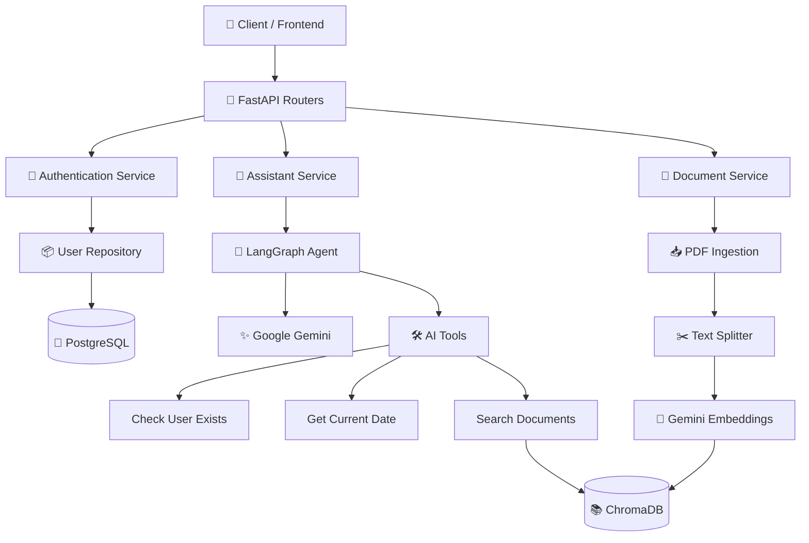
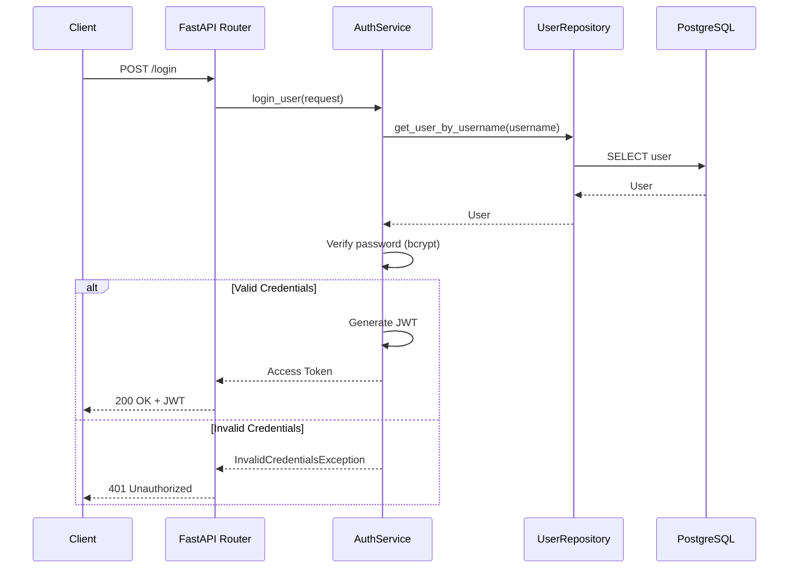
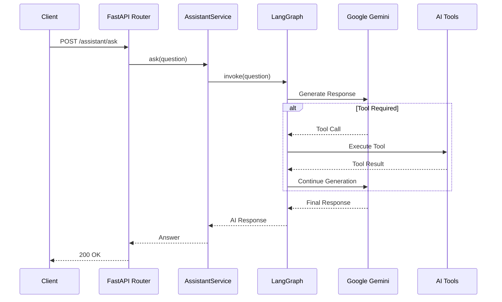
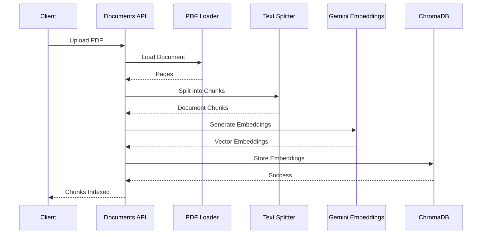
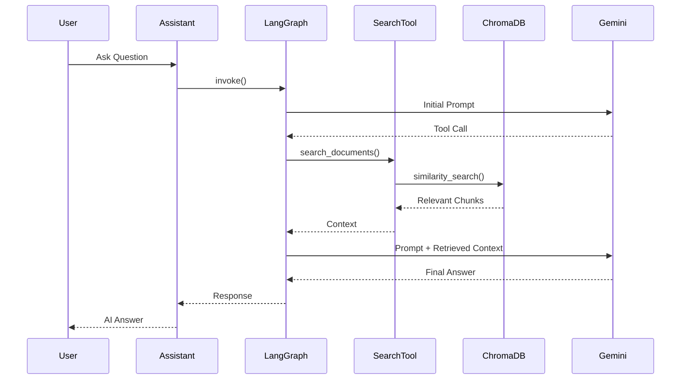

# Enterprise AI Assistant


**Enterprise AI Assistant** is a production-inspired AI backend built with **FastAPI**, **LangGraph**, and **Google Gemini**. It demonstrates modern backend engineering practices including JWT authentication, dependency injection, the repository pattern, retrieval-augmented generation (RAG), PDF document ingestion, Docker-based deployment, automated testing, and GitHub Actions CI.

The project was built to explore how traditional backend architecture can be combined with GenAI workflows to create scalable, AI-powered applications. Rather than functioning as a simple chatbot, it is designed as a backend service that can orchestrate AI models, business logic, enterprise data, and external tools through a structured and maintainable architecture.

## Why this project matters

Many organizations have large volumes of internal documentation, policies, knowledge bases, and operational procedures that are difficult for employees to search manually. This project demonstrates how an AI assistant can securely retrieve relevant information from enterprise documents, combine it with business logic and application data, and provide contextual responses through a REST API.

## ✨ Features

### 🔐 Authentication & Security

- User registration and login with **JWT-based authentication**
- Secure password hashing using **bcrypt**
- Protected API endpoints with reusable authentication dependencies

### 🤖 Enterprise AI Assistant

- Ask natural language questions through a REST API
- AI-powered responses using **Google Gemini**
- Intelligent workflow orchestration with **LangGraph**

### 🛠️ Tool Calling

The AI agent can dynamically invoke backend tools, including:

- Checking whether a user exists in the database
- Retrieving the current date
- Searching enterprise documents using RAG

### 📄 Retrieval-Augmented Generation (RAG)

- Upload PDF documents through an API
- Automatically split documents into semantic chunks
- Generate embeddings using **Gemini Embeddings**
- Store vectors in **ChromaDB**
- Retrieve relevant context before generating responses

### 🏗️ Backend Architecture

- Layered architecture following clean design principles
- Repository Pattern
- Service Layer
- Dependency Injection
- Global Exception Handling
- SQLAlchemy ORM with Alembic migrations

### 🗄️ Persistence

- PostgreSQL as the primary database
- SQLAlchemy ORM
- Alembic database migrations
- UUID-based user entities

### 🧪 Testing

- Unit tests using **pytest**
- In-memory SQLite for isolated database tests
- Mocked AI dependencies for deterministic testing
- High code coverage

### 🐳 Containerization

- Dockerized application
- Docker Compose for local development
- Environment-based configuration using `.env`

### 🚀 Continuous Integration

- Automated testing using **GitHub Actions**
- Test suite executed on every push and pull request
- Coverage reporting integrated into the CI pipeline

## 🏛️ System Architecture



### Architecture Highlights

- **FastAPI** exposes REST APIs for authentication, AI interactions, document ingestion, and health monitoring.
- **Authentication Service** handles user registration, login, password hashing, and JWT generation.
- **Assistant Service** orchestrates AI interactions by delegating requests to a LangGraph workflow.
- **LangGraph** determines whether the LLM should answer directly or invoke one or more backend tools.
- **Tool Calling** enables the AI agent to interact with application services such as database lookups, document retrieval, and utility functions.
- **RAG Pipeline** retrieves relevant document chunks from ChromaDB before the LLM generates its final response.
- **PostgreSQL** stores persistent application data, while **ChromaDB** stores vector embeddings for semantic search.

## 🔐 Authentication Flow



## 🤖 AI Request Flow



## 📄 Document Ingestion (RAG)



## 🔎 Retrieval-Augmented Generation (RAG)



# 🏗️ Design Principles

This project follows a **layered architecture** to separate responsibilities, improve maintainability, and keep business logic independent of infrastructure concerns. Each layer has a single responsibility and communicates only with the layers below it.

```text
                HTTP Request
                     │
                     ▼
            FastAPI Routers
                     │
                     ▼
             Service Layer
                     │
                     ▼
          Repository Layer
                     │
                     ▼
          PostgreSQL Database
```

For AI-related requests, the Service Layer orchestrates the LangGraph workflow:

```text
                HTTP Request
                     │
                     ▼
            FastAPI Router
                     │
                     ▼
          Assistant Service
                     │
                     ▼
             LangGraph Agent
                     │
        ┌────────────┴────────────┐
        ▼                         ▼
 Google Gemini              AI Tools (RAG, Date, User Lookup)
                                    │
                                    ▼
                              ChromaDB / PostgreSQL
```

---

## 🎯 Presentation Layer

**Responsibility**

- Exposes REST APIs
- Validates incoming requests
- Returns standardized responses
- Delegates business logic to services

**Components**

```text
app/routers/
```

**Key Principle**

> Routers should remain thin. They coordinate requests and responses without containing business logic.

---

## 🧠 Service Layer

**Responsibility**

- Implements business logic
- Coordinates repositories and AI workflows
- Handles authentication and authorization logic
- Orchestrates LangGraph execution

**Components**

```text
app/services/
```

**Key Principle**

> Services define _what_ the application does, independent of how data is stored or retrieved.

---

## 🗄️ Repository Layer

**Responsibility**

- Encapsulates all database interactions
- Executes queries using SQLAlchemy
- Keeps persistence logic separate from business logic

**Components**

```text
app/repositories/
```

**Key Principle**

> Services should never execute SQL directly. All persistence operations pass through repositories.

---

## 🤖 AI Layer

**Responsibility**

- Orchestrates AI workflows
- Executes tool-calling
- Performs Retrieval-Augmented Generation (RAG)
- Manages vector search and document ingestion

**Components**

```text
app/ai/
```

**Key Principle**

> AI orchestration is isolated from business logic, making workflows easier to extend, test, and maintain.

---

## 🔒 Security Layer

**Responsibility**

- Password hashing
- JWT generation and validation
- Authentication dependencies
- Protected route authorization

**Components**

```text
app/security/
```

**Key Principle**

> Security concerns are centralized to ensure consistent authentication across the application.

---

## 🛠️ Infrastructure Layer

**Responsibility**

- Database session management
- Application configuration
- Environment variables
- Dependency initialization

**Components**

```text
app/database/
app/config.py
```

**Key Principle**

> Infrastructure code provides technical capabilities without containing business rules.

---

## 🧪 Testing Strategy

The project follows a testing approach that emphasizes **fast, deterministic, and isolated** unit tests.

- External services such as Google Gemini, ChromaDB, and PostgreSQL are mocked during testing.
- An in-memory SQLite database is used for repository and API tests.
- Dependency overrides replace production implementations with lightweight test doubles.
- The test suite runs quickly without requiring API keys, containers, or network access.

This approach enables rapid feedback during development while ensuring the application's business logic remains thoroughly validated.

---

## 📐 Design Principles Applied

The implementation is guided by several established software engineering principles:

- **Single Responsibility Principle (SRP)** — Each class and module has one clearly defined responsibility.
- **Dependency Injection (DI)** — Dependencies are injected through FastAPI, improving modularity and testability.
- **Repository Pattern** — Database access is abstracted behind repositories.
- **Separation of Concerns** — Routing, business logic, persistence, AI orchestration, and security are isolated into dedicated layers.
- **Composition over Tight Coupling** — Services compose repositories, AI agents, and tools rather than instantiating them internally.
- **Testability by Design** — Components can be independently mocked and verified through unit tests.
